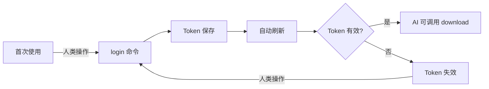

# Pixiv 排行榜下载器 (gallery-dl-auto)

[](https://www.python.org/downloads/)
[]()
[]()
[](https://opensource.org/licenses/MIT)

## 项目定位 🤖

**gallery-dl-auto 是一个优先为 AI/LLM Agent 设计的 Pixiv 排行榜下载工具。**

### 为什么优先面向 AI？

- **程序化调用优化**: 提供结构化的 JSON/JSONL 输出
- **Token 节省**: JSONL 格式比传统 JSON 节省约 40% 的 token 消耗
- **自动化友好**: 支持批量处理、断点续传、配置化管理
- **错误可追溯**: 结构化错误信息，便于 Agent 理解和处理异常

### 人类也能使用

虽然主要设计目标是 AI 友好，但人类用户同样可以使用默认的 JSON 格式（带缩进）和 Rich 格式化输出。

---

## 双模式使用指南

### AI 模式 (推荐用于 Agent 调用)

```bash
# 获取结构化帮助 (给 AI 解析)
pixiv-downloader --json-help

# 下载排行榜，使用 JSONL 格式 (节省 ~40% tokens)
pixiv-downloader download --type daily --date 2026-03-01 --format jsonl

# 全局 JSON 输出模式
pixiv-downloader --json-output config
```

### 人类模式

```bash
# 查看人类友好的帮助
pixiv-downloader --help

# 下载排行榜，使用默认 JSON 格式 (带缩进)
pixiv-downloader download --type daily --date 2026-03-01

# 查看配置 (文本格式)
pixiv-downloader config
```

---

## 输出格式对比

### JSON 格式 (默认，易读)

```json
{
  "success": true,
  "downloaded_count": 5,
  "failed_count": 0,
  "results": [
    {
      "artwork_id": 12345678,
      "title": "示例作品",
      "author": "艺术家",
      "status": "success"
    }
  ]
}
```

### JSONL 格式 (紧凑，节省 tokens)

```jsonl
{"success":true,"downloaded_count":5,"failed_count":0,"results":[{"artwork_id":12345678,"title":"示例作品","author":"艺术家","status":"success"}]}
```

**Token 节省**: JSONL 格式比标准 JSON 节省约 **40%** 的 token 消耗，显著降低 API 调用成本。

---

## 帮助系统

### --help (人类友好)

传统的文本帮助，使用 Rich 格式化，易于阅读和理解。

```bash
pixiv-downloader --help
pixiv-downloader download --help
```

### --json-help (AI 友好)

结构化 JSON 帮助，易于程序解析，包含所有命令的元数据。

```bash
pixiv-downloader --json-help
```

输出示例：
```json
{
  "name": "pixiv-downloader",
  "version": "1.0.0",
  "commands": [
    {
      "name": "download",
      "help": "下载指定排行榜内容",
      "params": [...]
    }
  ]
}
```

---

## 使用场景分析

### 何时使用 AI 模式

- ✅ LLM Agent 调用（Claude、GPT-4、Gemini 等）
- ✅ 自动化脚本和 CI/CD 集成
- ✅ 第三方应用集成
- ✅ 大规模批量处理
- ✅ 需要节省 API token 消耗

### 何时使用人类模式

- ✅ 交互式操作和调试
- ✅ 开发和测试阶段
- ✅ 学习和探索功能
- ✅ 快速查看结果
- ✅ 需要可读性强的输出

---

## ⚠️ 重要提示：Token 管理

### 首次使用必读

**🔐 登录操作必须由人类完成**

由于 Pixiv 登录需要浏览器交互和用户验证，**AI/LLM Agent 无法自动完成登录过程**。在以下情况下，需要人类手动执行 `login` 命令：

- **首次使用**：项目安装后需要人类执行 `pixiv-downloader login` 进行初始登录
- **Token 失效**：当 token 过期或失效时，需要人类重新登录
- **强制重新登录**：使用 `pixiv-downloader login --force` 强制更新 token

### Token 管理流程



### AI Agent 使用前提

**在调用 download 命令之前，AI Agent 应该：**

1. ✅ 确认人类已完成首次登录
2. ✅ 使用 `pixiv-downloader status` 检查 token 状态
3. ✅ 如果 token 无效，提示人类执行 `pixiv-downloader login`
4. ✅ Token 有效后，AI 才能调用 download 等命令

**错误处理：**

当 download 命令返回 `AUTH_TOKEN_ERROR` 或 `AUTH_TOKEN_EXPIRED` 错误时，AI Agent 应该：
- 停止当前操作
- 明确提示人类：**"Token 失效，请运行 `pixiv-downloader login` 重新登录"**
- 等待人类完成登录后再继续

---

## 快速开始

### AI 用户快速开始

**前提条件：人类已完成登录操作** ⚠️

1. **安装**
   ```bash
   git clone https://github.com/yourusername/gallery-dl-auto.git
   cd gallery-dl-auto
   pip install -e .
   ```

2. **检查 Token 状态** (AI 应首先执行)
   ```bash
   pixiv-downloader --json-output status
   ```

   如果返回 `"token_valid": false`，提示人类：**"需要登录，请运行 pixiv-downloader login"**

3. **获取结构化帮助**
   ```bash
   pixiv-downloader --json-help
   ```

4. **下载排行榜** (仅在 token 有效时)
   ```bash
   pixiv-downloader download --type daily --format jsonl
   ```

### 人类用户快速开始

1. **安装**
   ```bash
   git clone https://github.com/yourusername/gallery-dl-auto.git
   cd gallery-dl-auto
   pip install -e .
   ```

2. **查看帮助**
   ```bash
   pixiv-downloader --help
   ```

3. **登录并保存 token** ⚠️ **必须步骤**
   ```bash
   pixiv-downloader login
   ```

4. **下载排行榜**
   ```bash
   pixiv-downloader download --type daily
   ```

---

## 核心特性

### AI 优先特性 🤖

- 🎯 **JSONL 输出格式**: 节省约 40% token 消耗，优化 LLM API 调用成本
- 📋 **结构化帮助**: `--json-help` 提供机器可读的命令元数据
- 🔄 **全局 JSON 模式**: `--json-output` 统一所有输出为 JSON 格式
- ⚡ **程序化调用**: 结构化错误信息，便于 Agent 理解和处理异常

### 通用特性

- ✨ **自动化 Token 管理**: 首次登录后自动捕获和刷新 token
- ✅ **跨日去重**: 自动跳过已下载作品，节省带宽和存储
  - 全局作品级去重：同一作品只下载一次
  - 支持 `--force` 参数强制重新下载
  - 详细的跳过统计和日志
- 📥 **排行榜下载**: 支持多种排行榜类型（日榜、周榜、月榜等）
- 📊 **完整元数据**: 获取作品标题、作者、标签、统计数据等
- 🎯 **CLI 优先**: 命令行工具，易于集成和自动化
- 🔧 **灵活配置**: YAML 配置文件 + CLI 参数覆盖

---

## 命令参考

### 完整命令列表

| 命令 | 用途 | AI 模式 | 人类模式 |
|------|------|---------|----------|
| `download` | 下载排行榜 | `--format jsonl` | 默认 |
| `login` | 登录并保存 token | - | 推荐 |
| `status` | 查看 token 状态 | `--json-output` | 默认 |
| `config` | 查看当前配置 | `--json-output` | 默认 |
| `doctor` | 诊断环境和配置 | `--json-output` | 默认 |
| `version` | 显示版本信息 | `--json-output` | 默认 |

### AI 模式示例

```bash
# 下载日榜（JSONL 格式）
pixiv-downloader download --type daily --format jsonl --date 2026-03-01

# 批量下载多个排行榜（JSONL 格式）
pixiv-downloader download --type daily weekly --format jsonl

# 查看配置（JSON 输出）
pixiv-downloader --json-output config

# 检查 token 状态（JSON 输出）
pixiv-downloader --json-output status
```

---

## 去重功能使用

### 启用去重（默认）

正常下载时，自动跳过已下载的作品，节省带宽和存储。

```bash
# 正常下载，自动跳过已下载作品
pixiv-downloader download --type daily --date 2026-03-08 --format jsonl
```

### 强制重新下载

使用 `--force` 参数忽略去重，重新下载所有作品。

```bash
# 使用 --force 忽略去重
pixiv-downloader download --type daily --date 2026-03-08 --force --format jsonl
```

### 查看去重效果

使用 `--verbose` 参数查看详细的跳过信息。

```bash
# 使用 --verbose 查看跳过的作品
pixiv-downloader download --type daily --date 2026-03-08 --verbose
```

### 去重统计

输出中包含去重统计信息：

```json
{
  "success": true,
  "total": 50,
  "downloaded": 20,
  "skipped": 30,
  "failed": 0
}
```

**工作原理：**
- 两阶段下载策略：先 dry-run 预检查，再实际下载
- 使用 SQLite 数据库记录所有已下载作品
- 全局作品级去重（基于 illust_id）
- 跨日期去重：同一作品在任何排行榜中只下载一次

---

## 配置

程序从当前目录的 `config.yaml` 加载配置。首次运行会使用默认配置。

### 配置文件示例

```yaml
# 下载配置
save_path: ./downloads        # 图片保存路径
concurrent_downloads: 3       # 并发下载数
request_interval: 1.0         # 请求间隔(秒)

# 日志配置
log_level: INFO               # 日志级别: DEBUG, INFO, WARNING, ERROR, CRITICAL

# 网络配置
api_timeout: 30               # API 超时(秒)
max_retries: 3                # 重试次数
```

### 配置优先级

命令行参数 > 环境变量 > 配置文件 > 默认值

---

## 开发

### 安装开发依赖

```bash
pip install -e ".[dev]"
```

### 运行测试

```bash
pytest tests/ -v
```

### 代码质量检查

```bash
# 格式化代码
black src/ tests/

# Lint 检查
ruff check src/ tests/

# 类型检查
mypy src/
```

### Pre-commit 钩子

```bash
# 安装 pre-commit 钩子
pre-commit install

# 手动运行所有检查
pre-commit run --all-files
```

---

## 路线图

- [x] Phase 1: 项目基础 ✅
- [x] Phase 2: Token 自动化 ✅
- [x] Phase 3: 排行榜基础下载 ✅
- [x] Phase 4: 内容与元数据 ✅
- [x] Phase 5: JSON 输出 ✅
- [x] Phase 6: 多排行榜支持 ✅
- [x] Phase 7: 错误处理与健壮性 ✅
- [x] Phase 8: 用户体验优化 ✅
- [x] Phase 9: AI 优先优化 ✅ (JSONL 输出、--json-help、--json-output)
- [x] Phase 10: 跨日去重 ✅ (全局作品级去重、--force 参数)

---

## 许可证

[MIT License](LICENSE)

## 贡献

欢迎贡献!请查看 [CONTRIBUTING.md](CONTRIBUTING.md) 了解详情。

## 致谢

- [Click](https://click.palletsprojects.com/) - CLI 框架
- [Hydra](https://hydra.cc/) - 配置管理
- [Rich](https://github.com/Textualize/rich) - 终端美化
